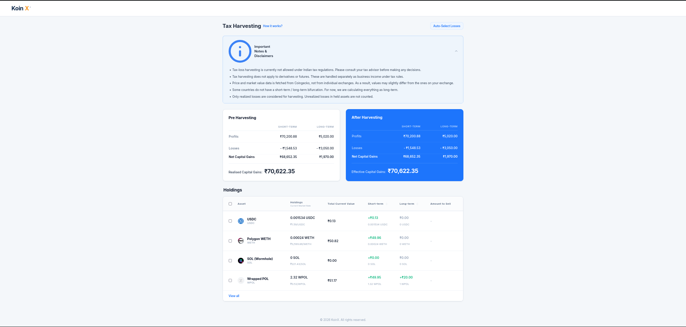
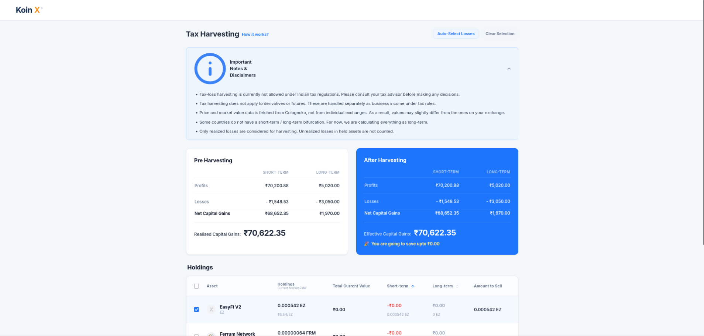

# KoinX Tax Loss Harvesting Dashboard

> Built as part of the KoinX Frontend Internship Assignment.

A responsive React-based web application that simulates a Tax Loss Harvesting dashboard. The application allows users to select crypto assets carrying short-term or long-term gains/losses and dynamically visualize how harvesting impacts effective capital gains and potential tax savings.

---

## 🔗 Live Demo

YOUR_VERCEL_LINK

---

## 📦 GitHub Repository

https://github.com/Vybhthevibe/koinx-tax-loss-harvesting.git
---

## ✨ Features

### 📊 Tax Harvesting Dashboard
- Displays:
  - Pre-Harvesting capital gains
  - After-Harvesting capital gains
- Dynamically recalculates:
  - profits
  - losses
  - net gains
  - realized capital gains

### 🎉 Savings Estimation
- Displays:
  
  `🎉 You're going to save ₹X`
  
  when post-harvesting gains become lower than pre-harvesting gains.

### 📋 Interactive Holdings Table
- Multi-row selection using checkboxes
- Select/Deselect All functionality
- Sorting support:
  - Short-Term Gains
  - Long-Term Gains
- “View All” expansion support
- Responsive table with horizontal scrolling on smaller devices

### 📌 Disclaimer Accordion
- Expandable disclaimer and notes section inspired by the original KoinX UI.

### 📱 Responsive Design
- Optimized for:
  - Desktop
  - Tablet
  - Mobile

### ⚡ Loading & Error States
- Simulated API delays
- Loader UI during fetch operations
- Graceful error handling

---

## 📸 Screenshots

### Desktop View


### Selected Holdings State


### Mobile Responsive View


---

## 🛠️ Tech Stack

| Technology | Usage |
|---|---|
| React + Vite | Frontend Framework |
| Tailwind CSS | Styling |
| JavaScript (ES6+) | Application Logic |
| Mock APIs | Simulated Backend |
| Vercel | Deployment |

---

## ⚙️ Setup Instructions

```bash
git clone YOUR_GITHUB_LINK

cd koinx-tax-loss-harvesting

npm install

npm run dev
```

Runs locally at:

```txt
http://localhost:5173
```

---

## 📂 Folder Structure

```bash
src/
 ├── components/
 │    ├── Header.jsx
 │    ├── DisclaimerAccordion.jsx
 │    ├── SummaryCard.jsx
 │    ├── HoldingsTable.jsx
 │    ├── HoldingRow.jsx
 │    ├── Loader.jsx
 │
 ├── services/
 │    ├── api.js
 │
 ├── utils/
 │    ├── calculations.js
 │    ├── formatters.js
 │
 ├── data/
 │    ├── holdings.js
 │    ├── capitalGains.js
 │
 ├── App.jsx
 ├── main.jsx
 └── index.css
```

---

## 🧮 Tax Calculation Logic

### Net Gains Formula

```txt
Net STCG = STCG Profits - STCG Losses

Net LTCG = LTCG Profits - LTCG Losses

Realized Capital Gains =
Net STCG + Net LTCG
```

### Harvesting Rules

- If selected holding gain is positive:
  
  → Add to profits

- If selected holding gain is negative:
  
  → Add ABS(gain) to losses

### Savings Formula

```txt
Savings =
Pre-Harvesting Capital Gains
-
Post-Harvesting Capital Gains
```

Savings banner is displayed only when:

```txt
Post-Harvesting Gains < Pre-Harvesting Gains
```

---

## 🧠 Design Decisions

- Used React Hooks and derived state instead of Redux to keep the architecture lightweight and maintainable.
- Mock APIs were implemented using Promises and setTimeout to simulate asynchronous data fetching.
- Tailwind CSS was used for rapid responsive UI development.
- Calculation logic was extracted into reusable utility functions for maintainability.
- Modular component structure was used for scalability and readability.

---

## 📄 Assumptions

- Mock API data is static and simulated locally.
- Tax calculations are simplified for assignment purposes.
- Human-readable tooltip formatting was intentionally simplified based on assignment instructions.

---

## 👨‍💻 Author

Vybhav N

Built for the KoinX Frontend Internship Assignment.